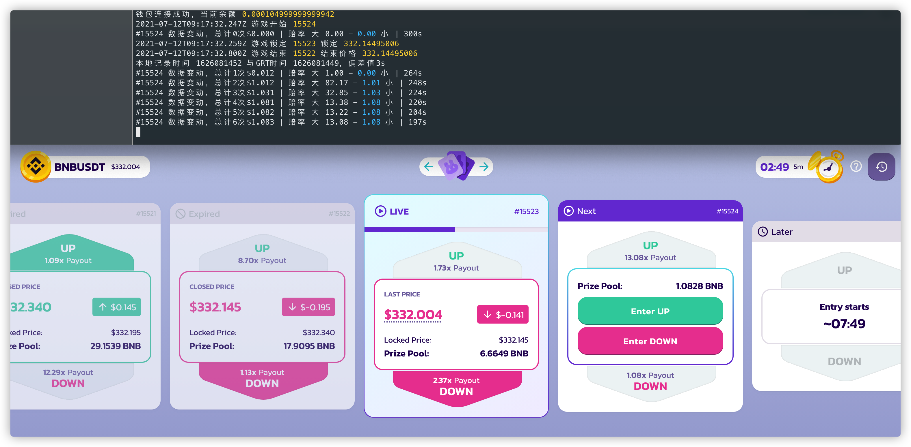
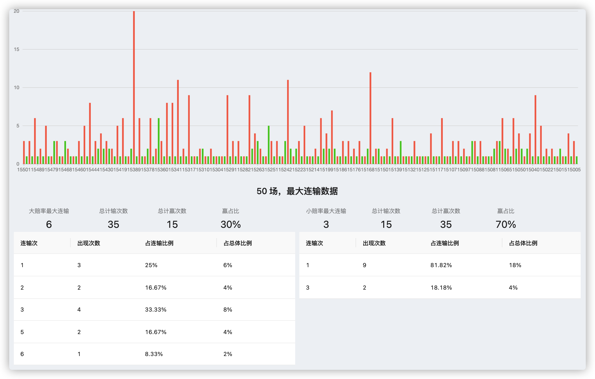
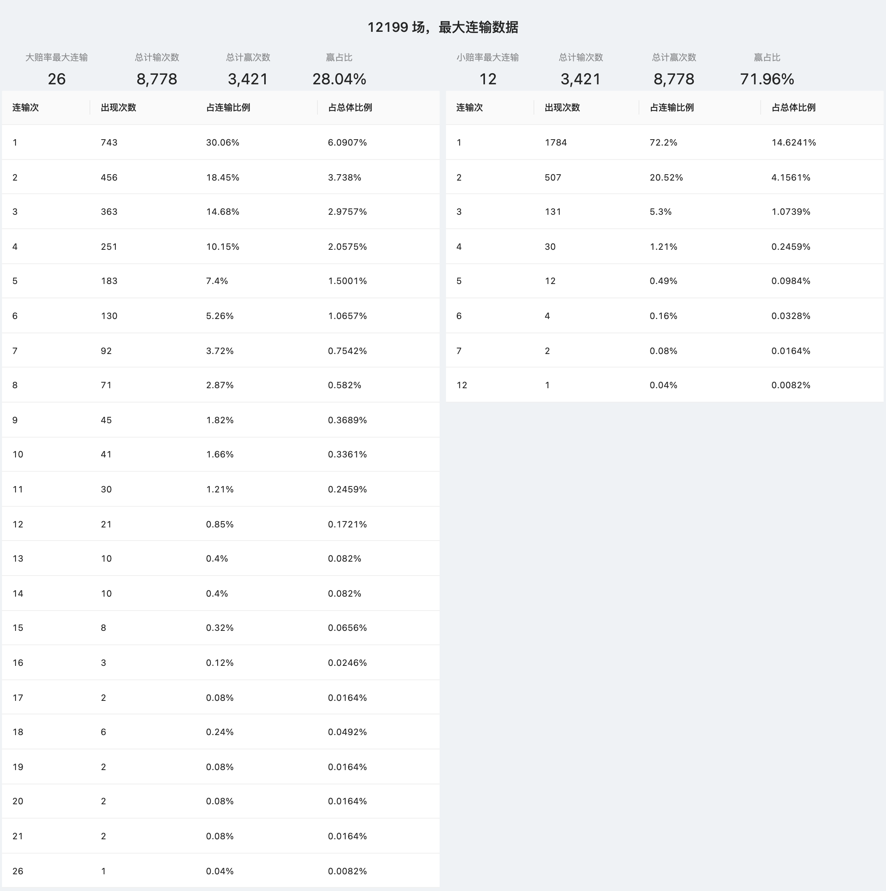

# PancakeSwap Prediction Game Bot

## Features

For [PancakeSwap Prediction](https://pancakeswap.finance/prediction) , it automatically monitors the betting data on the chain, and makes or bets according to the set betting algorithm for low odds.

## Betting strategy

### High odds (>2.0x) double bet

`High odds (>2.0x)` double bet, for example, when the bet is 0.1 for the first time, 0.2 for the second bet if it is lost, 0.4 for the third bet if it is lost, and so on.

Because there is no upper limit on betting, in theory, as long as you finally win once, you can make a profit, but there is a risk of failure (the highest losing streak has been 26 consecutive losses)

### Low odds (<2.0x) call

`Low odds (<2.0x)` followed the vote. In the statistical stage, the crawler was used to pull the game records of *> 12000* games for data analysis and found that the winning rate of low odds was higher than 69.5%, and those who lost consecutively The number of times is less, and the order is based on this phenomenon

At the same time, a double betting mechanism can be established. For example, if the bet is 0.1, if the next bet is lost, it will be `0.1 + n / (m -1)`, where `m = odds`, `n = last bet amount`

## Risk

The above contents are all theoretical, but `Prediction` has adjusted the game at present. In fact, when there are only a few seconds left in the game time, the bet will be judged to be a failure.

As a result, the successful betting will deviate greatly from the data when the final bet is actually locked. None of the above strategies can be carried out effectively, so the open source sharing of this project, maybe you can find its value.

## how to use

After installing `node.js@14.x` and `yarn@1.x` versions, do the following in the project directory

1. Install resource dependencies

> Execute `yarn` to install resource dependencies

2. Basic configuration

> Copy `priject-config_BAK.json` to `priject-config.json` and configure it

Note: `account` and `privateKey` are required;

The rest of the parameters are optional. At present, the `telegram` message push has not been perfected, so there is no such function.

3. Execute startup

> Execute `yarn dev` to start the service.

## Introduction to project structure and core modules

`wallet/wallet.ts`: wallet module, obtain wallet balance through `ethers`;

`precent-game/marketDataMonitor.ts`: game monitoring and various event callbacks, such as game start, game end, game betting data changes;

`precent-game/betManager.ts`: Betting manager component, for betting algorithm management, or to implement functions such as simulated betting;

`precent-game/bet.ts`: betting component, use wallet for betting function, provide `low rate` and `high rate` betting functions;

`precent-game/main.ts`: main automation logic component

## Betting data monitoring mode

1. On-chain monitoring, monitoring prediction contract `events` on `BSC chain` based on `ethers`, recommended;
2. BSCScan monitoring, based on [Prediction contract on BSCScan](https://bscscan.com/address/0x516ffd7d1e0ca40b1879935b2de87cb20fc1124b) for crawler request monitoring, requires crawler proxy;
3. GRT monitoring, based on `The Graph` API for polling request monitoring, the same as the method obtained in the official website betting record, but using the crawler pool to speed up the acquisition frequency.

## common problem

> 1. Why not use multithreading

The actual betting will only produce a large amount of data changes when it is close to the end, and after testing, the existing betting data update frequency, single-threaded high-frequency crawler and multi-threaded acquisition are not much different.

> 2. Risk

All opinions and technical realizations of this project only represent personal positions and personal operations, and do not have any guiding role. Operation based on this is at your own risk.

Also refer to [#risk](#risk)

> 3. How to get historical game data

You can refer to the `precent-game/getBetHistory.ts` code in the repository to obtain historical data through GraphQL.

At the same time, in `src/images/`, screenshots of 50 games and 12,000+ games of game losing streak analysis are provided for reference only.

> 4. Why does the code have no `test cases`, not even the compilation function

🙂 This is just an experimental project and I'm lazy.

## Sponsorship and Contact

